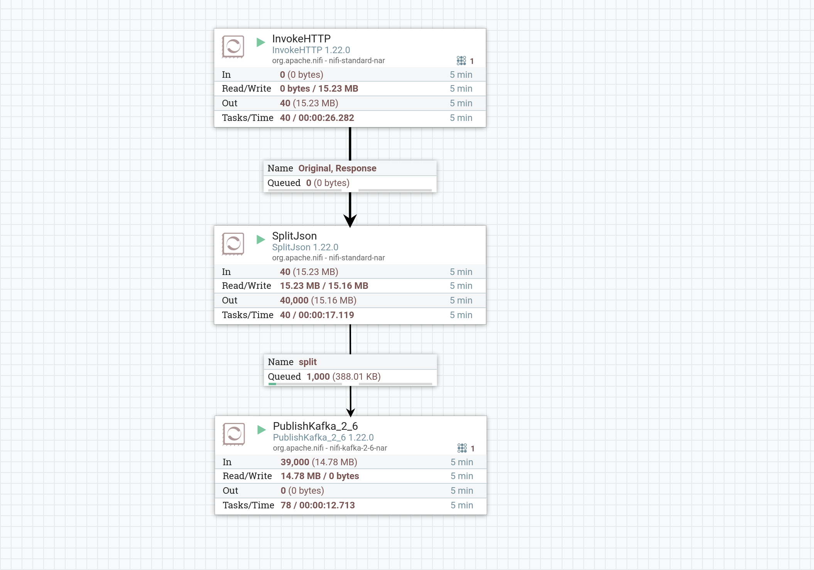
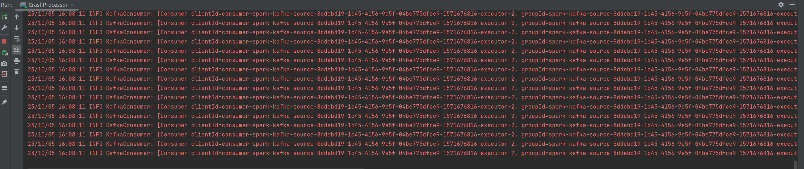
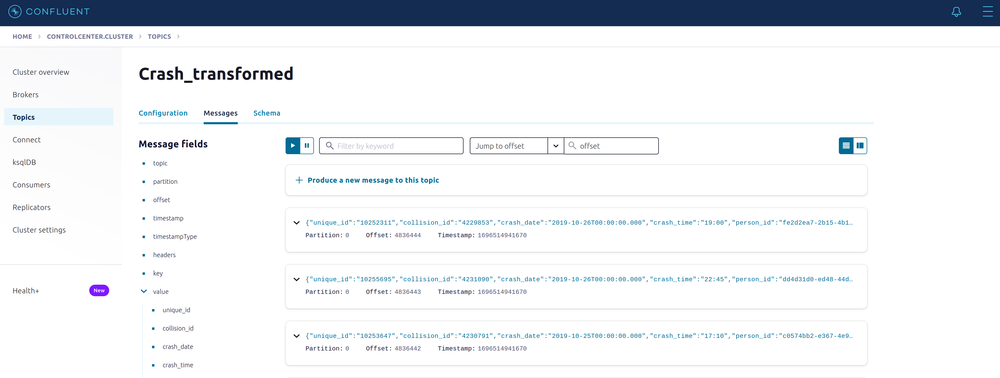
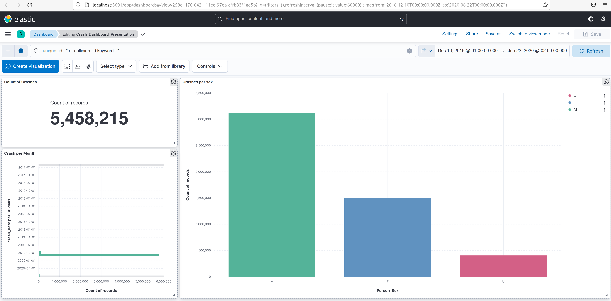
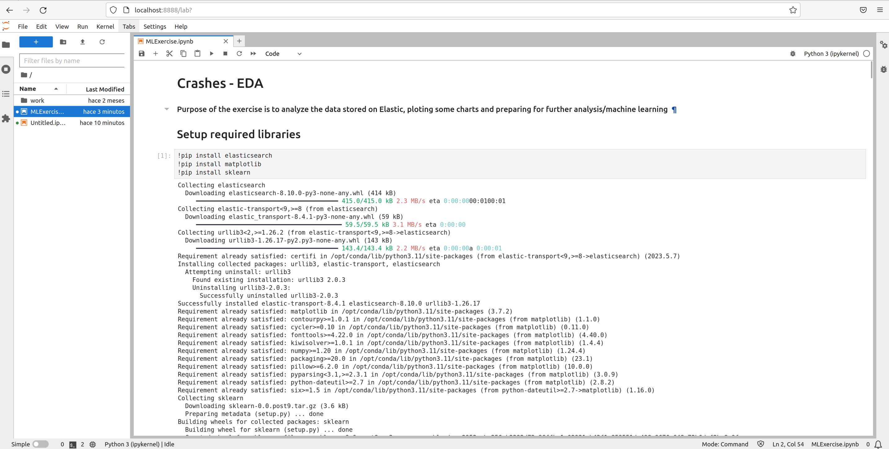

# Exercise about Motor Vehicle Collisions Person
### Authors: Christian Molina / Pau Ros

## Data Ingestion
You can view the data in this link: https://data.cityofnewyork.us/Public-Safety/Motor-Vehicle-Collisions-Person/f55k-p6yu 

First of all, We'll run Apache NIFI with following scheme: NIFI_CrashVehiclePeople.xml.

Start the NiFi service:
```
docker-compose start nifi
```
Upload scheme and drag & drop the mentioned scheme.

Now start zookepper, broker in Kafka and control center:
```
docker-compose start zookeeper broker control-center 
```
Next step press play to Nifi and it will collect the json data and send it to Kafka.



## Data Processing 
We can get data about topic (consumer), in this case "CrashMotorVehiclesPeople" retrieve data and Spark process this information and send to new topic "Crash_transformed".

You can review the compiled code, specially the java class "CrashProcessor.java" and you have to view different messages in the intellij console:



## Data Storage
At this stage, We can configurate elastic search sink json and change the topic that we want to use, in this case "Crash_transformed".


Now start kafka connect, elastic search and kibana. 
```
docker-compose start kafka-connect elasticsearch kibana
```
In this part, We'll have to load the elastic search sink json in the control center connectors part. After We can visit kibana and create the Dashboard about crashes.

## Data Visualization
The visualizations should look something like this:


## Data Analysis
Run Jupiter:
```
docker-compose start jupyter
```
* Connecting to the node:
    * Run on command line: `docker exec -it docker_jupyter_1 bash`
    * On docker container get token: `jupyter server list`
    * Copy the token and just use it in the login screen




